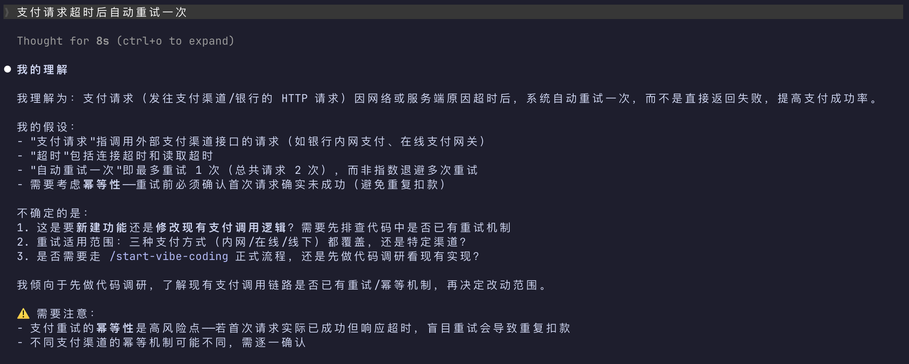

# Understand First

English | [中文](./zh-CN/README.md)

Make Claude Code show its understanding before taking action. If it got it right, proceed. If it got it wrong, one sentence fixes it — align direction when the cost is zero.

Ever been here? You type out a prompt, wait patiently for the AI to generate results, and then realize it has gone completely astray. The AI invents extra assumptions and misreads your requirements from the very beginning, costing you plenty of wasted time and leaving you annoyed. You're forced to restart or keep clarifying via repeated chats, wasting time iteratively. To avoid misinterpretation next time, you end up cramming every tiny detail into the prompt, which ends up consuming even more of your time.

Andrej Karpathy [also ranted about this](https://x.com/karpathy/status/2015883857489522876): the most common problem with models is that they make assumptions for you and then run with them without looking back.

Understand First solves this — it makes the AI lay out its understanding for you to see. One glance tells you if it's right. A few seconds to course-correct, instead of cursing after the work is done.

## Demo




## Installation

### Global Install (works across all projects)

One-line command:

```bash
curl -fsSL https://raw.githubusercontent.com/luckybilly/understand-first/main/hooks/install.sh | sh
```

Or copy this prompt into Claude Code:

```text
Install Understand First globally for me.

Please run this command:
curl -fsSL https://raw.githubusercontent.com/luckybilly/understand-first/main/hooks/install.sh | sh

Let me know the result when done.
```

### Install for Current Project

Copy this prompt into Claude Code:

```text
Install Understand First for the current project.

1. Check if a CLAUDE.md file exists in the project root
2. If it doesn't exist, fetch the content from https://raw.githubusercontent.com/luckybilly/understand-first/refs/heads/main/CLAUDE.md and save it as CLAUDE.md in the project root
3. If CLAUDE.md already exists, fetch the full content from the URL above and append it to the end of the existing file (do not overwrite existing content)
4. Let me know when installation is complete
```

## How It Works

Understand First inserts an understanding checkpoint into every interaction. Before touching code, the AI shows:

- What it understood (full intent inferred from context)
- What it filled in (the parts you didn't specify, and how it filled them)
- What risks it found (downstream impacts or oversights you may not have considered)
- What it plans to do (so you can course-correct before work begins)

Simple tasks (renaming a variable, etc.) get a 2-3 line confirmation. Complex or ambiguous tasks get the full breakdown.

The output format looks like this:

```text
My understanding: [full intent]
My role: [perspective, omitted when not needed]
My assumptions: [what was inferred]
My plan: [steps]
⚠️ Heads up: [risks and oversights, omitted when not needed]
```

## Verify Installation

After installing, type this in Claude Code:

> Fix the null pointer bug in the code

If the AI shows its understanding, role, and plan before taking action, it's working.

## FAQ

**Does it slow me down?**
Simple commands get 1-3 lines of confirmation — it won't block you. Vague or high-risk requests get more detail, but that's still faster than rework.

**Token cost?**
50-500 extra tokens per interaction, depending on task complexity. Claude Code has prompt caching, which significantly reduces the cost of repeated context.

**Will the AI always comply?**
Global installation (Hook): hard enforcement, usually followed. CLAUDE.md approach: soft protocol, followed most of the time but not guaranteed.

**Does it work with other AI tools?**

Yes. Send this prompt to your AI coding tool and it will install itself:

```text
Please read the Understand First protocol from https://raw.githubusercontent.com/luckybilly/understand-first/refs/heads/main/CLAUDE.md and install it in the rule file format used by your current tool. Let me know what you did when done.
```

## License

MIT
