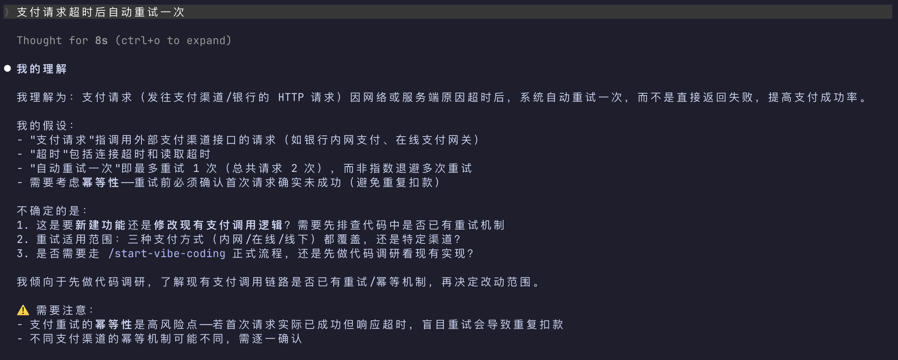
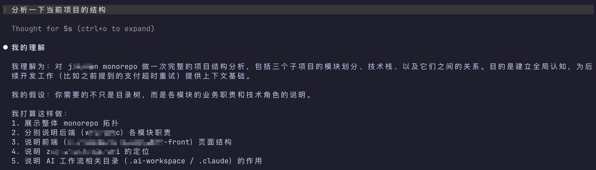

# Understand First

[English](./en-US/README.md) | 中文

让 Claude Code 在动手之前先展示它的理解。理解对了再干活，理解错了一句话就能纠——在成本为零的时候把方向对齐。

你有没有这样的经历：敲完提示词眼巴巴等着 AI 跑完，结果一看，彻底跑偏。它自己脑补了一堆假设，从一开始就理解歪了，大把时间白费，心里格外烦躁。只能重来，或者反复跟它对话纠正，时间就这样在一轮轮的对话中浪费掉了。下次恨不得把每个细节都写进提示词里，生怕它再理解歪，结果又耗掉更多时间。

Andrej Karpathy [吐槽过同一件事](https://x.com/karpathy/status/2015883857489522876)：模型最普遍的问题，就是替你做完假设之后头也不回地跑。

Understand First 就是为了解决这个——让 AI 先把它的理解摊出来给你看，一眼就知道对不对，几秒钟就能纠偏，不用等活干完了再骂人。

## 效果





## 安装

### 全局安装（所有项目生效）

一行命令：

```bash
curl -fsSL https://raw.githubusercontent.com/luckybilly/understand-first/main/hooks/install.sh | UNDERSTAND_FIRST_PROTOCOL_URL=https://raw.githubusercontent.com/luckybilly/understand-first/main/CLAUDE.md sh
```

或者复制这段提示词到 Claude Code：

```text
帮我全局安装 Understand First。

请执行以下命令：
curl -fsSL https://raw.githubusercontent.com/luckybilly/understand-first/main/hooks/install.sh | UNDERSTAND_FIRST_PROTOCOL_URL=https://raw.githubusercontent.com/luckybilly/understand-first/main/CLAUDE.md sh

完成后告诉我安装结果。
```

### 为当前项目安装

复制这段提示词到 Claude Code：

```text
为当前项目安装 Understand First。

1. 检查项目根目录是否存在 CLAUDE.md 文件
2. 如果不存在，从 https://raw.githubusercontent.com/luckybilly/understand-first/refs/heads/main/CLAUDE.md 获取内容并保存为项目根目录下的 CLAUDE.md
3. 如果已存在 CLAUDE.md，从上面的 URL 获取完整内容，追加到现有文件末尾（不要覆盖已有内容）
4. 完成后告诉我安装已完成
```

## 工作原理

在每次交互中插入一个理解确认环节。AI 在碰代码之前先展示：

- 它理解了什么（从上下文推断完整意图）
- 它补全了什么（你没说清的部分，它怎么填的）
- 它发现了什么风险（你可能没注意到的下游影响或遗漏）
- 它打算怎么做（让你在动手前就能纠偏）

简单任务（重命名变量之类）出 2-3 行确认就过了。复杂或有歧义的任务会完整展开。

输出格式长这样：

```text
我理解为：[完整意图]
我的定位：[角色视角，无事省略]
我的假设：[推断补全的内容]
我打算这样做：[步骤]
⚠️ 需要注意：[风险和遗漏，无事省略]
```

## 验证安装成功

安装后在 Claude Code 里输入：

> 修一下代码里的空指针 bug

如果 AI 先展示它的理解、定位和计划，就说明装上了。

## FAQ

**会拖慢效率吗？**
简单的指令 1-3 行内容展示，不会拦着你。模糊或高风险的需求会多展示一些，但比返工快得多。

**Token 开销？**
每次交互多 50-500 tokens，取决于任务复杂度。Claude Code 有 prompt 缓存，重复上下文的成本会大幅降低。

**AI 一定会遵守吗？**
全局安装（Hook）硬性注入，大概率遵守。CLAUDE.md 方式是软协议，大部分时候遵守，但不保证。

**支持其他 AI 工具吗？**

支持。把下面这段提示词发给你的 AI 编程工具，它会自己安装：

```text
请阅读 https://raw.githubusercontent.com/luckybilly/understand-first/refs/heads/main/CLAUDE.md 中的 Understand First 协议内容，然后把它安装成你当前使用的工具的规则文件格式。安装完成后告诉我你做了什么。
```


## 许可证

MIT
